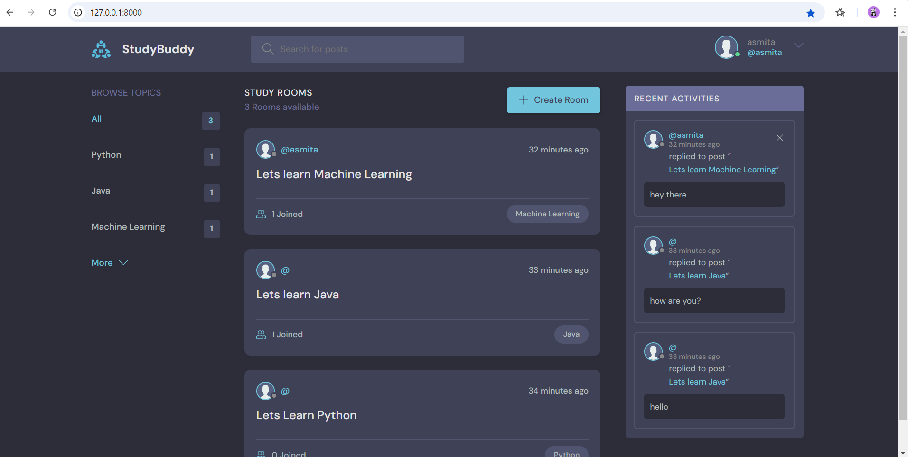
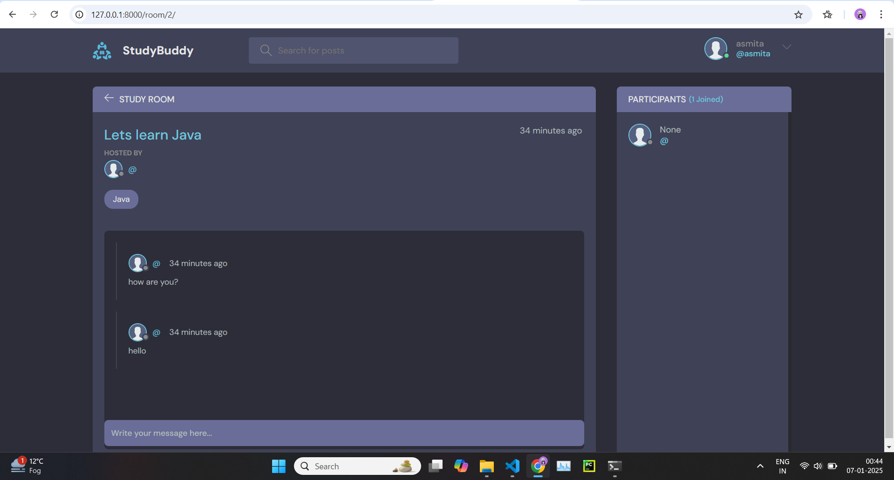

# StudyBuddy
A collaborative platform that enables students to create topic-specific rooms and engage in real-time discussions to enhance learning and productivity.
## Features
- Create study rooms for specific topics.
- Real-time chat functionality for effective discussions.
- User-friendly interface for seamless navigation.
- Secure and private rooms for focused collaboration.
## Screenshots



## Tech Stack
- **Frontend:** HTML, CSS, JavaScript
- **Backend:** Python, Django
- **Database:** SQLite (or any database you used)
- **Others:** Bootstrap for styling, Any third-party libraries or APIs

## Installation and Setup

1. Clone the repository:
   ```bash
   git clone https://github.com/yourusername/StudyBuddy.git
   cd StudyBuddy
   
Create a virtual environment:
>python -m venv env
source env/bin/activate  # For Windows: env\Scripts\activate

Install dependencies:
>pip install -r requirements.txt

Apply migrations:
>python manage.py migrate

Run the development server:
> python manage.py runserver

Open the app in your browser:
> http://127.0.0.1:8000/


---

## How to Use
1. Register or log in to access the app.
2. Create a study room by specifying a topic.
3. Share the room link with friends to join.
4. Start engaging in real-time chat discussions.


---

## Contributing
Contributions are welcome! Please follow these steps:

1. Fork the repository.
2. Create a new branch:
>git checkout -b feature/your-feature-name

3.Make your changes and commit them:
>git commit -m "Add your message here"

Push to the branch:
>git push origin feature/your-feature-name

Open a pull request and describe your changes.

---
## Acknowledgments
- [Django Documentation](https://docs.djangoproject.com/)
- Inspiration from the student community!
